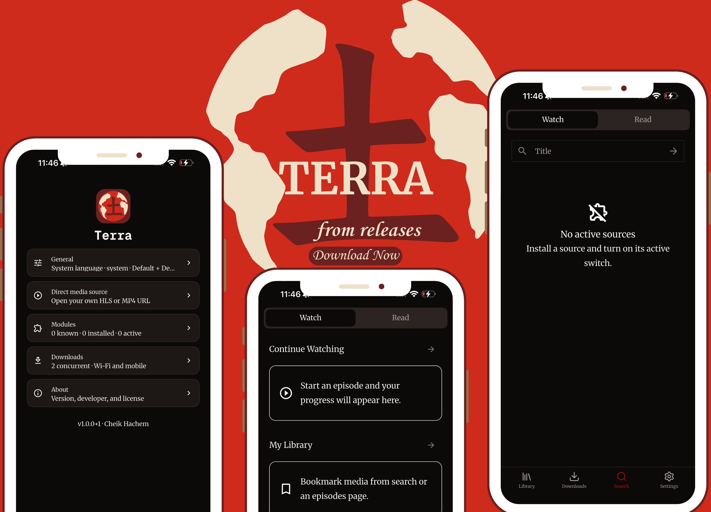

  

<h1 align="center">Terra</h1>

<strong>Your media, your sources.</strong>

  

> **Beta software** — Terra is still in early development. Expect bugs and breaking changes.

## What is Terra?

Terra is a media library and player for your own sources. It does **not** provide any content or sources out of the box, and it is **not** responsible for any sources you choose to install or use. Please only use Terra for lawful purposes.

## Features

- Watch and read media — anime, TV, movies, manga, novels, and more
- Install modules using the **Mangayomi** and **Sora** extension formats
- Download media for offline playback
- Polished UI, video player, manga reader, and novel reader
- Online subtitles via **OpenSubtitles** and **SubDL** (SubDL requires an API key)

## Credits

Terra builds on ideas and formats from these projects:

- [Sora](https://github.com/cranci1/Sora) — module format
- [Mangayomi](https://github.com/kodjodevf/mangayomi) — module format, player, manga reader, and novel reader

## Download

Get the latest build for Android, iOS, Windows, and Linux from the [Releases](https://github.com/cheikhhachem/terra/releases) page.

## Disclaimer

Terra is a tool for organizing and playing media from sources you provide. The developers do not host, distribute, or endorse any copyrighted content. Users are solely responsible for complying with the laws in their jurisdiction.
